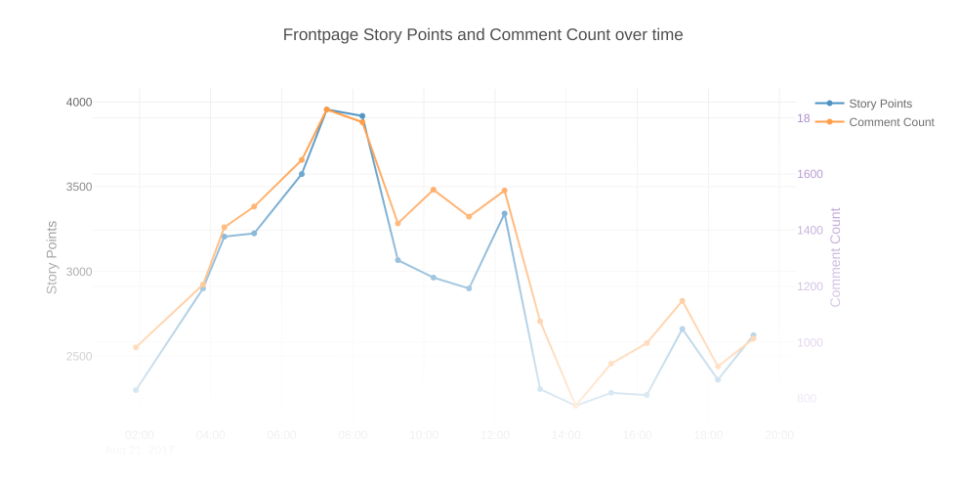

# HN Frontpage Activity Monitoring with Webtask.io and Google BigQuery

## What is this

This project consists of three components:

* [`webtask`](https://webtask.io/) cron job script (built using rollup.js) [./src](./src)
  * Every hour (or determined by other CRON configurations) the script takes _two_ 15-seconds-apart snapshots of Hacker News frontpage statistics (top 25 stories and their rank, story point and comment count)
  * [Streaming](https://cloud.google.com/bigquery/streaming-data-into-bigquery) results to a BigQuery table for later batch analysis
* A`webtask` endpoint to serve last 24 hours worth of data from BigQuery [./serve](./serve)
* Some visualization and analysis using Jupyter and python BigQuery client [./analyze](./analyze)

[Link to view Notebook](https://nbviewer.jupyter.org/github/yiransheng/hn-activities-in-bq/blob/master/analyze/HN%20Activities.ipynb)

[Linke to view HTML](https://htmlpreview.github.io/?https://raw.githubusercontent.com/yiransheng/hn-activities-in-bq/master/analyze/HN_activities_notebook.html)




## Deploying

1. Create a GCP [service account](https://cloud.google.com/compute/docs/access/service-accounts), with BigQuery access, download a JSON key for the account

2. Create an empty BigQuery table with the scheme specified in [./src/bq-schema.json]()

3. Create `webtask` secrets file with the following content:

   ```
   gcloud=<content of json key>
   projectId=<gcp project id>
   datasetId=<bigquery dataset id>
   tableId=<bigquery table id>
   ```

4. Set ENV variable `WT_SECRECTS_FILE` to the path of above file

5. run `./deploy.sh`

## Running Jupyter Notebook

Configure the following environment variables:

```
export BQ_PRIVATE_KEY="/path/to/json_key";
export BQ_PROJECT_ID=<project id>
export BQ_DATASET_ID=<dataset id>
export BQ_TABLE_ID=<table id>
```

Start jupyter server:

```
jupyter notebook ./analyze
```

## hnstats_collect: a webtask CRON job

To generate webtask script, run:

```
npm run build
```

This will bundle all source code in [./src]() and necessary library dependencies into a single javascript file as `dist/index.js`, in addition `babel` is used to transpile ES6+ code to ES5 and common js module format. Certain dependencies are skipped if they are provided by `webtask` run time. Such as `request`, `stream`, `axios` and `crypto`. For a detailed list refer to `rollup.config.js`. 


To schedule a cron job running the following after `webtask` cli is installed:

```
# run every 30 minitues
wt cron 30m ./dist/index.js --name "hnstats_collect" --secrets-file <path to secrets file>
```


### Code Overview

The core logic of data fetching is defined in `src/main.js` as an `async` function `fetchStats`. It fetches top 25 stories (filtering out `type=job` entries) using [HackerNews api](https://github.com/HackerNews/API). Then the script waits 15 seconds (initial plan was wait 1-5 minutes, unfortunately this will cause `webtask` runtime timeout error). Afterwards the stats of the _same_ 25 stories are refetched, with deltas in **rank**, **story points** and **comment count** computed. Finally the two set of entries are merged and pushed to BigQuery.


### Challenges in Implementation

The most difficult part was to get `dist/index.js` fit under `webtask`'s file size limit (12280 bytes). I had a misconception about webtask, I thought any external npm dependencies has to be inlined and bundled into a single file if they are not provided by webtask.


Official BigQuery client `@google-cloud/bigquery` has an enormous file size when bundled making it infeasible to use. I had to create a custom BigQuery client implementation (supporting only a single api I needed `table.insertAll`). Underlying authorization process (OAuth handshake and requesting correct google cloud scopes) is handled by `google-service-account` npm package - which depends on `gtoken`. 

Unfortunately, when inlined, `gtoken` is still to big for `webtask`'s taste - due to one of its dependencies `google-p12-pem`. To support full google clould api auth, `gtoken` needs to work with legacy p12 key. However, for my use case (using Google Service Account JSON key), this functionality is not needed. I finally solved this problem by using `rollup-plugin-alias`, and alias the `google-p12-pem` package to an empty module.


Overall this was a "frustratingly fun" process, hinting at some tradeoffs a "serverless" architecture like `webtask` tends to face.


## hnstats_serve: a webtask endpoint

Note: I have not got this part working yet, `webtask` currently reports the following error even though said dependency was configured correctly in [./serve/package.json]():

```
Error: ENOENT: no such file or directory, symlink '/data/_verquire/@google-cloud/bigquery/0.9.6/node_modules/@google-cloud/bigquery' -> '/data/io/f5a1dce3d96843738a4593cde3f2bf92/node_modules/@google-cloud/bigquery
```

